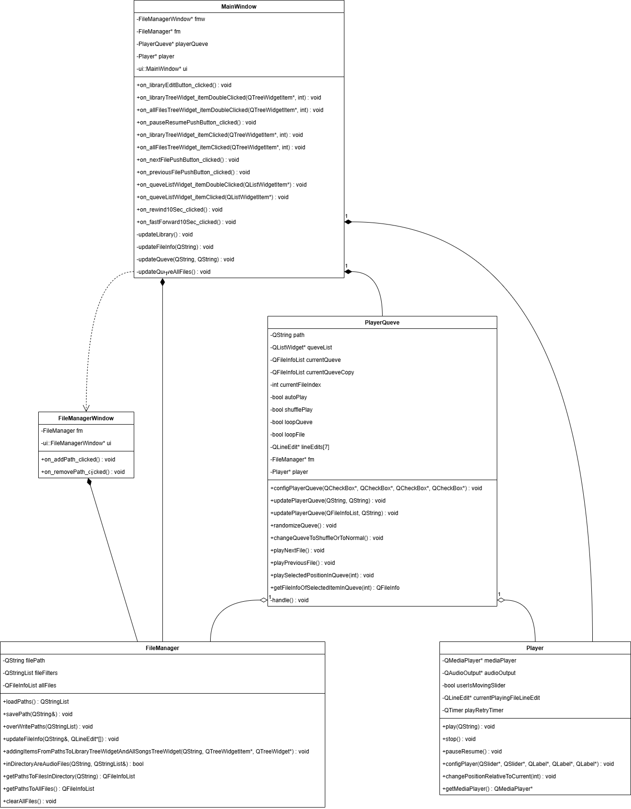
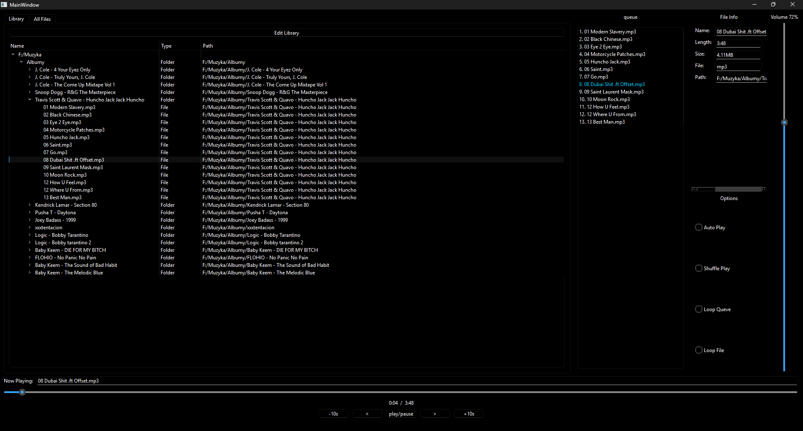
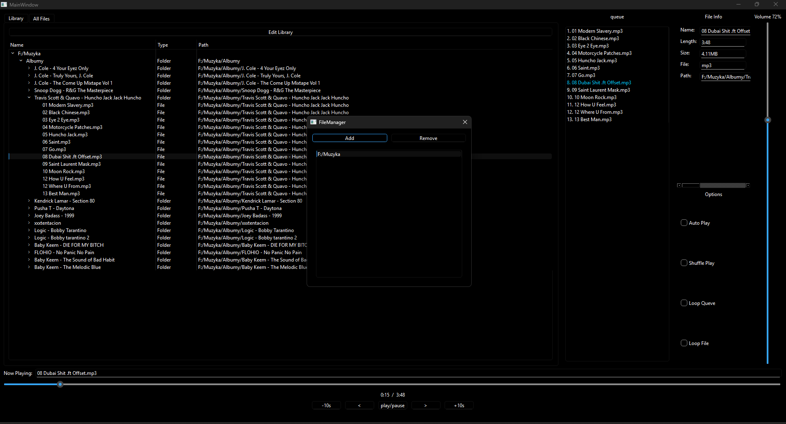

# Project Documentation – Audio Player

## 1. Introduction

### 1.1 Project Goal

The goal of the project is to create an application for playing files in MP3, WAV, and FLAC formats. The application allows managing a file library, playing audio files, controlling volume, pausing, seeking, and setting various playback options such as looping or shuffle. The project uses the Qt framework version 5 or 6.

### 1.2 Project Scope

The project includes the following functionalities:

* A user interface for managing audio files.
* Playback of audio files in MP3, WAV, FLAC formats.
* Volume control, pausing, seeking, and queue playback.
* Adding folders to the application’s library.
* Viewing detailed file information such as name, extension, size, and duration.

## 2. Assumptions

### 2.1 Functional

* **Library management**: Users can browse and add folders with audio files to the library.
* **Audio playback**: The application allows playing audio files.
* **Playback control**: The application offers buttons for pause, resume, forward/backward seeking, and volume adjustment.
* **Playback queue**: Users can enable looping for a single file or the entire queue. There is also a shuffle option and automatic playback of the next file in the queue.
* **File information**: The application enables viewing detailed information about each file.

### 2.2 Non-functional

* **Audio format support**: The application plays audio files in MP3, WAV, and FLAC formats.
* **Intuitive user interface**: The application should be easy to use.

## 3. Requirements

### 3.1 Hardware Requirements

* **Operating system**: Windows 11.
* **Free disk space**: 100MB.
* **Sound**: A sound card supporting standard audio formats.

### 3.2 Software Requirements

* **Qt Library**: Qt 5.15 or Qt 6 (depending on the version).
* **C++ Compiler**: A compiler supporting C++11 or newer.

## 4. Class Descriptions and Functionalities

### 4.1 UML Class Diagram

### 4.2 Class Descriptions

* **`FileManager`**: Responsible for file management. Handles adding, removing, saving, and loading audio file paths.
* **`Player`**: Responsible for audio playback. Uses `QMediaPlayer` and `QAudioOutput` for audio output.
* **`PlayerQueve`**: Manages the playback queue of audio files.
* **`FileManagerWindow`**: A dialog window for managing file folders.

## 5. User Interface

