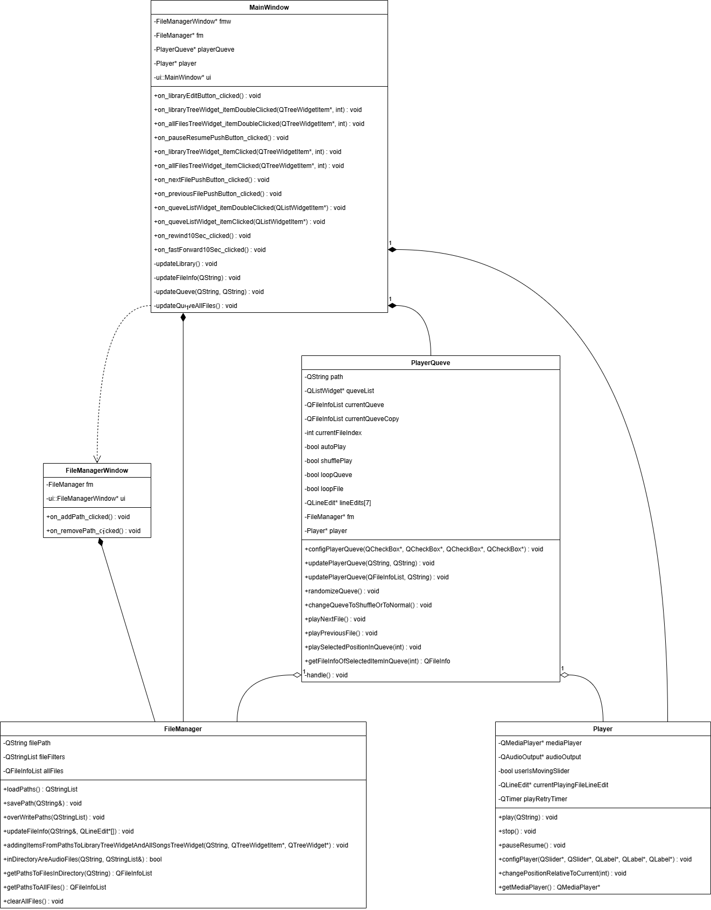
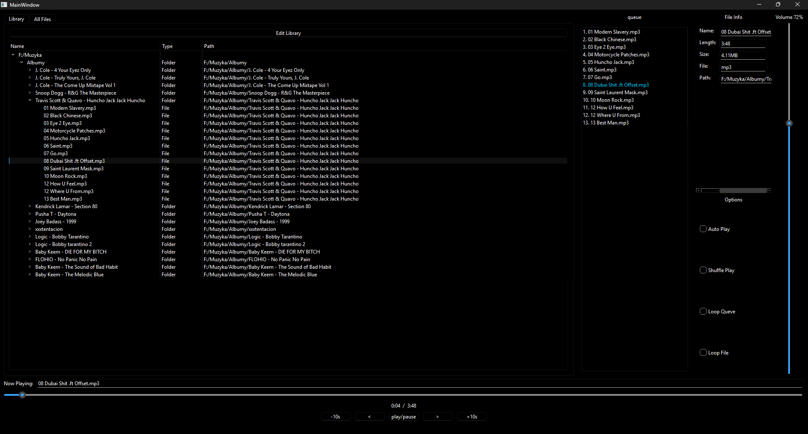
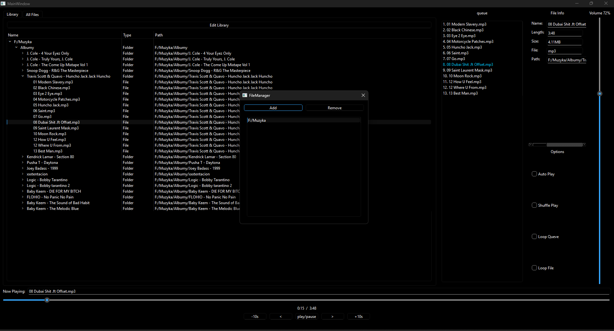

# Project Documentation – Audio Player

## 1. Introduction

### 1.1 Project Goal

The goal of this project is to create an application for playing audio files in MP3, WAV, and FLAC formats. The application allows managing a file library, playing audio files, controlling volume, pausing, seeking, and setting various playback options such as looping or shuffle. The project uses the Qt framework version 5 or 6.

### 1.2 Project Scope

The project includes the following functionalities:
- A user interface for managing audio files.
- Playback of audio files in MP3, WAV, and FLAC formats.
- Volume control, pause, seek, and playback queue.
- Adding folders to the application library.
- Viewing detailed file information such as filename, extension, size, and audio duration.

## 2. Assumptions

### 2.1 Functional Requirements

- **Library management**: the user can browse and add folders with audio files to the library.
- **Audio playback**: the application enables audio playback.
- **Playback control**: the application provides buttons to pause, resume, seek (forward and backward), and adjust volume.
- **Playback queue**: the user can enable looping of a single file or the entire queue. Shuffle mode and automatic playback of the next file are also available.
- **File information**: the application allows viewing detailed file information.

### 2.2 Non-functional Requirements

- **Audio format support**: the application supports playback of MP3, WAV, and FLAC files.
- **Intuitive user interface**: the application should be easy to use.

## 3. Requirements

### 3.1 Hardware Requirements

- **Operating system**: Windows 11.
- **Free disk space**: 100MB.

### 3.2 Software Requirements

- **Qt Library**: Qt 5.15 or Qt 6 (depending on the version).
- **C++ compiler**: a compiler supporting C++11 or newer.

## 4. Class and Functionality Description

### 4.1 UML Class Diagram

### 4.2 Class Descriptions

- **`FileManager`**: responsible for file management. Handles adding, removing, saving, and loading audio file paths.
- **`Player`**: responsible for audio playback. Uses `QMediaPlayer` and `QAudioOutput` for audio output.
- **`PlayerQueve`**: manages the audio playback queue.
- **`FileManagerWindow`**: a dialog window for managing file folders.

## 5. User Interface

  

